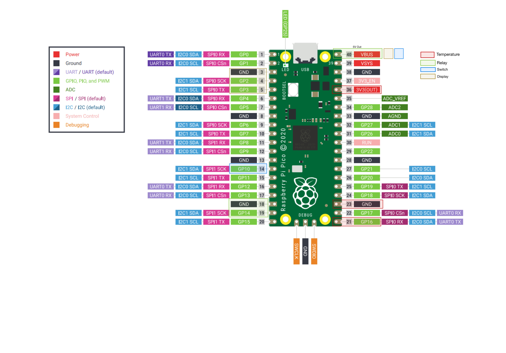

# DS18B20 Controlled Freezer Project
This project transforms a standard freezer into a digitally temperature-controlled unit using a DS18B20 temperature sensor. It allows the user to switch between "Refrigerator" and "Freezer" modes using a physical switch. The current mode and temperature are displayed on an I2C LCD. This system is developed using MicroPython on a Raspberry Pi Pico. By controlling the temperature through a relay, which turns the freezer on and off, this project can also revive freezers or refrigerators with malfunctioning thermostats.

## Hardware Requirements
- [Raspberry Pi Pico](https://www.berrybase.de/raspberry-pi-pico-rp2040-mikrocontroller-board)
- [DS18B20 Temperature Sensor](https://www.berrybase.de/ds18b20-ic-digitaler-temperatursensor-wasserdicht?c=98)
- [LCD Display](https://www.berrybase.de/alphanumerisches-lcd-16x2-blau/weiss?c=124)
- [I2C Interface](https://www.berrybase.de/iic/i2c-interface-fuer-1602/2004-displays)
- [Relay Module](https://www.berrybase.de/5v-1-kanal-relais-modul?c=2242)
- Physical Switch, Wires, Power Supply, ...

## Setup and Installation
1. **Hardware Assembly:**
   - Connect the DS18B20 temperature sensor, I2C LCD, relay, and switch to the Raspberry Pi Pico according to the provided schematics. If you choose different GPIO-Pins, adjust the code respectively.
     Default GPIO-Usage:
     
   - Ensure the built-in thermostat of the freezer is set to its highest setting.

2. **Software Setup:**
   - Flash your Raspberry Pi Pico with the latest version of MicroPython.
   - Clone this repository to your local machine.
   - Transfer the main script and the other .py files to your Raspberry Pi Pico.

3. **Configuration:**
   - Adjust the temperature thresholds in the script as per your requirements for both 'Refrigerator' and 'Freezer' modes.
   - Change the displayed names of the modes depending on your preferred language (Kuehlschrank == Refrigerator; Gefrierschrank = Freezer)
